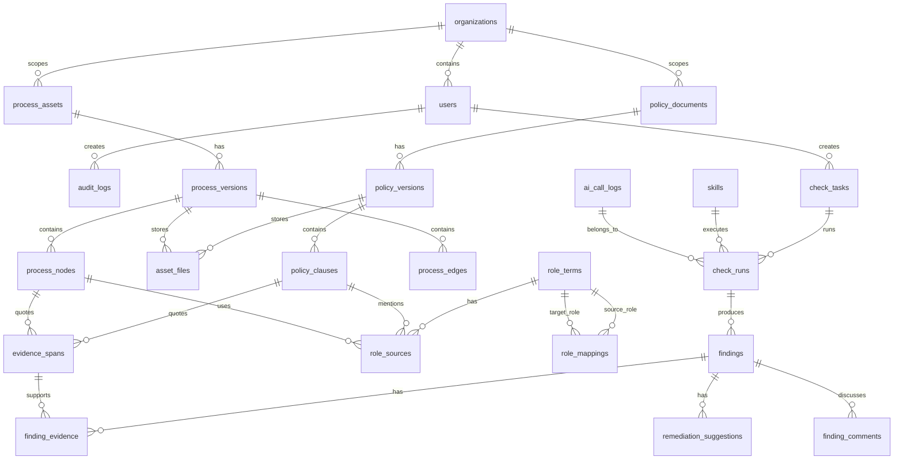
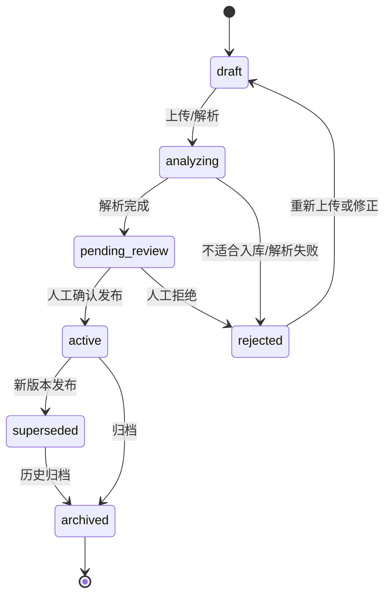
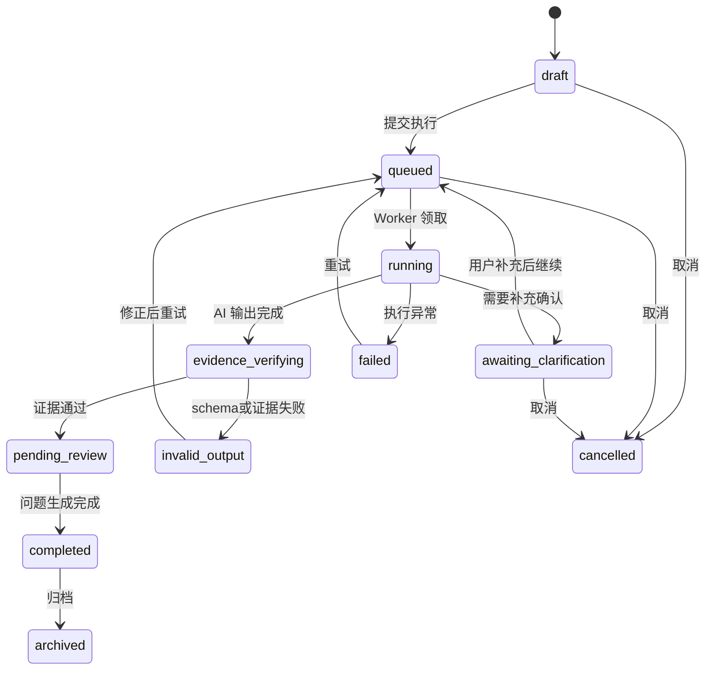
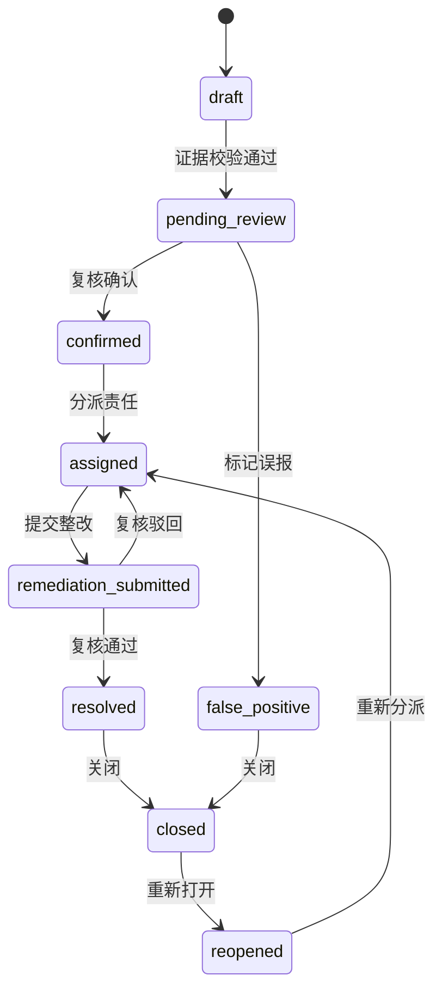

# 制度助手生产化计划

## 1. 目标与边界

本计划面向当前“AI 制度治理工作台 Demo”走向可试点、可运维、可审计的生产化版本。系统核心闭环为：

```text
资产入库
→ 结构化解析
→ 人工确认
→ 发起核验任务
→ AI/规则协同执行
→ 证据白名单校验
→ 形成问题项
→ 整改闭环
→ 复核归档
```

生产化版本必须保留三条底线：

1. AI 结论不得直接成为正式制度依据，必须绑定制度条款、BPMN 节点或人工确认记录。
2. 制度、流程、角色、问题、任务、模型调用均要可追溯。
3. 未经人工确认的解析结果、映射结果、整改建议只能处于候选或待复核状态。

本计划只定义工程与治理落地要求，不替代具体需求规格说明。业务代码修改由后续 Agent 分工执行。

## 2. 三 Agent 协作机制

### 2.1 角色分工

| Agent | 职责 | 产出 | 不得做的事 |
|---|---|---|---|
| Agent A：计划管理/架构把关 | 维护生产化路线、数据边界、契约、质量门禁；审查跨模块影响 | 架构文档、里程碑拆解、ERD、状态机、权限矩阵、API 契约摘要 | 直接改业务代码、回滚他人改动 |
| Agent B：后端/数据/AI 治理 | 实现数据库迁移、领域模型、API、任务执行、AI 审计与证据校验 | Alembic 迁移、FastAPI 接口、服务层、测试、AI 调用日志 | 绕过契约改前端假数据、把 API Key 写入仓库 |
| Agent C：前端/交互/质量体验 | 实现资产工作台、任务流、问题闭环、权限态展示、错误恢复 | React 页面、组件、状态管理、前端测试、可用性修正 | 自行定义后端字段、跳过空态/错误态/加载态 |

### 2.2 协作节奏

每个阶段按 3 个节拍推进：

1. **契约冻结**：Agent A 输出或更新数据模型、API 契约、状态机、验收标准。
2. **并行实现**：Agent B/C 基于契约实现，发现不一致必须先记录到 `docs/decision-log.md` 或阶段计划补丁。
3. **集成验收**：三方按质量门禁验收，失败项形成阻塞清单，不能以“Demo 可用”替代验收。

### 2.3 变更冲突规则

| 场景 | 处理规则 |
|---|---|
| 工作树已有他人改动 | 不回滚、不格式化无关文件、不批量重写 |
| 契约字段不满足实现 | 先补文档或提出变更，不在前后端各自发明字段 |
| 状态机需要新增状态 | 必须同时更新状态定义、API 返回枚举、前端展示、测试用例 |
| AI 输出 schema 变化 | 必须更新 Skill schema、输出校验、前端类型、评测样例 |
| 数据迁移破坏已有 Demo 数据 | 需要提供 seed 重建脚本和迁移说明 |

### 2.4 交付物命名

| 类型 | 位置 | 命名 |
|---|---|---|
| 架构/计划 | `docs/` | `*-plan.md`、`*-architecture.md` |
| 决策 | `docs/decision-log.md` | `D-编号 标题` |
| API 契约 | `docs/api-contract.md` 或 OpenAPI 导出 | 路径、请求、响应、错误码齐全 |
| 数据迁移 | `backend/alembic/versions/` | 时间戳加语义名称 |
| 评测结果 | 本地生成，不入库 | `backend/quality-eval-result.json` |

## 3. 阶段里程碑

### M0：契约冻结与风险清点

目标：把生产化边界、数据模型和状态机冻结到可开发程度。

交付：

| 项 | 验收标准 |
|---|---|
| ERD 初版 | 覆盖用户、组织、资产、条款、BPMN、角色、任务、运行、问题、证据、审计 |
| 权限矩阵 | 覆盖系统管理员、制度管理员、流程管理员、核验人员、复核人员、只读审计员 |
| 状态机 | 资产状态、任务状态、问题状态、建议状态均有合法流转 |
| API 契约摘要 | 每个核心页面有对应接口、错误码、分页/筛选策略 |
| 质量门禁 | 后端、前端、AI、数据迁移、权限、安全均有阻断条件 |

退出条件：Agent B/C 能不猜字段地开始实现。

### M1：数据底座与迁移

目标：从 Demo SQLite 走向可迁移、可审计的数据底座。短期可继续支持 SQLite，本阶段必须按 PostgreSQL 兼容建模。

交付：

| 项 | 验收标准 |
|---|---|
| SQLAlchemy 模型 | 与 ERD 一致，枚举集中定义 |
| Alembic 迁移 | 空库可建表，已有 Demo 数据可重建 |
| Seed 分层 | demo seed、测试 seed、最小系统 seed 分离 |
| 审计表 | 记录用户、动作、对象、前后值摘要、请求 ID |
| 文件存储接口 | 本地存储封装为接口，后续可替换对象存储 |

退出条件：`pytest backend/tests -q` 通过，seed/reset 后前端能加载资产。

### M2：资产入库与人工确认

目标：制度文件、BPMN 文件、角色清单进入受控状态机。

交付：

| 项 | 验收标准 |
|---|---|
| 制度上传分析 | 分析阶段不直接入库，返回条款树、元数据、问题、适入库判断 |
| 制度保存 | 只有用户确认后写入正式资产，保留上传分析快照 |
| BPMN 入库 | 保存原始 XML、结构化节点、解析日志和校验结果 |
| 角色抽取与映射 | 角色来源可追溯，人工映射优先于自动映射 |
| 资产版本 | 新版本不覆盖旧版本，支持 active/archived 切换 |

退出条件：上传、确认、保存、查看、归档均可追溯。

### M3：核验任务与问题闭环

目标：把 Skill 运行从聊天体验固化为可追踪任务。

交付：

| 项 | 验收标准 |
|---|---|
| 任务创建 | 支持多制度冲突、制度与流程校验、无制度依据识别 |
| 执行记录 | 每次运行保存输入快照、输出快照、模型、耗时、费用、证据校验结果 |
| 问题项 | Finding 必须绑定证据，未通过证据校验不能进入待复核 |
| 闭环流转 | 支持认领、整改、复核、关闭、驳回、误报标记 |
| 评论/附件 | 复核意见、整改说明可留痕 |

退出条件：任务失败可重试，问题关闭有完整审计记录。

### M4：AI 治理与评测

目标：把模型能力纳入可控、可评测、可降级的工程体系。

交付：

| 项 | 验收标准 |
|---|---|
| Provider Adapter | 支持 DeepSeek 和本地 deterministic fallback |
| Prompt 版本 | 每次运行记录 skill、prompt、schema、模型版本 |
| 输出校验 | JSON schema、证据白名单、置信度阈值、专业问题抛出 |
| Golden Dataset | 覆盖三个核验场景和上传入库场景 |
| 质量报告 | 命中率、误报率、证据准确率、schema 合规率可重复生成 |

退出条件：真实 LLM 不可用时系统可降级；真实 LLM 可用时评测指标达标。

### M5：生产部署与运维

目标：具备试点部署能力。

交付：

| 项 | 验收标准 |
|---|---|
| 配置管理 | `.env.example` 完整，不包含密钥 |
| 日志 | 请求日志、任务日志、模型调用日志、审计日志分层 |
| 健康检查 | API、数据库、文件存储、AI Provider、知识库服务状态可见 |
| 备份恢复 | 数据库和文件资产有备份恢复演练说明 |
| 发布清单 | 启动命令、迁移命令、回滚策略、烟测脚本齐全 |

退出条件：新环境按文档可完成部署、迁移、seed、烟测。

## 4. 数据库 ERD 概览

### 4.1 核心实体



### 4.2 表职责摘要

| 表 | 职责 | 关键字段 |
|---|---|---|
| `users` | 系统用户 | `id`, `name`, `email`, `status`, `organization_id` |
| `roles` | 权限角色 | `id`, `code`, `name` |
| `user_roles` | 用户角色关系 | `user_id`, `role_id` |
| `organizations` | 组织/部门 | `id`, `name`, `parent_id`, `status` |
| `policy_documents` | 制度主档 | `id`, `code`, `name`, `category`, `owner_org_id`, `status` |
| `policy_versions` | 制度版本 | `id`, `document_id`, `version_no`, `effective_date`, `status`, `source_analysis_id` |
| `policy_clauses` | 条款树 | `id`, `version_id`, `clause_no`, `title`, `content`, `parent_id`, `order_index` |
| `process_assets` | BPMN 流程主档 | `id`, `code`, `name`, `business_domain`, `owner_org_id`, `status` |
| `process_versions` | 流程版本 | `id`, `process_id`, `version_no`, `bpmn_xml_file_id`, `status` |
| `process_nodes` | BPMN 结构化节点 | `id`, `version_id`, `node_key`, `name`, `node_type`, `role`, `action`, `condition` |
| `process_edges` | BPMN 边 | `id`, `version_id`, `from_node_id`, `to_node_id`, `condition` |
| `role_terms` | 角色清单 | `id`, `name`, `normalized_name`, `role_type`, `review_status` |
| `role_sources` | 角色来源 | `id`, `role_id`, `source_type`, `source_id`, `quote` |
| `role_mappings` | 制度角色与流程角色映射 | `id`, `policy_role_id`, `process_role_id`, `mapping_type`, `confidence`, `review_status`, `created_by` |
| `asset_files` | 原始文件与解析文件 | `id`, `asset_type`, `file_name`, `mime_type`, `storage_uri`, `sha256`, `uploaded_by` |
| `upload_analyses` | 上传分析快照 | `id`, `file_id`, `asset_type`, `result_json`, `questions_json`, `suitable`, `status` |
| `check_tasks` | 核验任务 | `id`, `task_type`, `name`, `target_scope_json`, `status`, `created_by` |
| `check_runs` | 单次运行 | `id`, `task_id`, `skill_id`, `input_snapshot`, `output_snapshot`, `status`, `started_at`, `finished_at` |
| `skills` | Skill 定义版本 | `id`, `code`, `version`, `schema_json`, `prompt_hash`, `enabled` |
| `ai_call_logs` | 模型调用日志 | `id`, `provider`, `model`, `prompt_hash`, `request_hash`, `response_hash`, `token_usage`, `cost` |
| `evidence_spans` | 证据片段 | `id`, `source_type`, `source_id`, `quote`, `page_no`, `char_start`, `char_end`, `verified` |
| `findings` | 问题项 | `id`, `task_id`, `run_id`, `finding_type`, `severity`, `status`, `confidence`, `owner_org_id` |
| `finding_evidence` | 问题证据 | `finding_id`, `evidence_id`, `evidence_role` |
| `remediation_suggestions` | 整改建议 | `id`, `finding_id`, `suggestion_text`, `review_status`, `generated_by` |
| `finding_comments` | 闭环意见 | `id`, `finding_id`, `comment_type`, `content`, `created_by` |
| `audit_logs` | 审计日志 | `id`, `actor_id`, `action`, `object_type`, `object_id`, `before_hash`, `after_hash`, `request_id` |

### 4.3 数据建模约束

1. 所有业务主表必须有 `created_at`, `updated_at`, `created_by`, `updated_by`。
2. 枚举值集中管理，不允许前端和后端各自维护不同拼写。
3. 原始文件不得被解析结果覆盖；解析结果必须引用 `asset_files.sha256`。
4. `check_runs.input_snapshot` 必须包含当次运行使用的资产版本 ID，而不是只保存资产主档 ID。
5. `findings` 写入前必须至少有一条 `finding_evidence`，除非状态为 `draft` 或 `invalid_output`。
6. `ai_call_logs` 不保存完整敏感原文时，至少保存 hash、模型名、token、耗时和错误摘要。

## 5. 权限矩阵

### 5.1 角色定义

| 角色 | 定位 |
|---|---|
| `system_admin` 系统管理员 | 配置系统、用户、角色、集成、全局数据修复 |
| `policy_admin` 制度管理员 | 管理制度入库、版本、条款确认、制度角色 |
| `process_admin` 流程管理员 | 管理 BPMN 入库、流程节点确认、流程角色 |
| `checker` 核验人员 | 创建任务、运行 Skill、查看任务结果、提交问题 |
| `reviewer` 复核人员 | 复核问题、确认/驳回整改、关闭问题、标记误报 |
| `auditor` 只读审计员 | 查看资产、任务、问题、审计日志，不可写 |

### 5.2 操作权限

| 功能 | system_admin | policy_admin | process_admin | checker | reviewer | auditor |
|---|---:|---:|---:|---:|---:|---:|
| 查看制度资产 | 允许 | 允许 | 允许 | 允许 | 允许 | 允许 |
| 上传/分析制度文件 | 允许 | 允许 | 禁止 | 禁止 | 禁止 | 禁止 |
| 保存制度入库 | 允许 | 允许 | 禁止 | 禁止 | 禁止 | 禁止 |
| 发布/归档制度版本 | 允许 | 允许 | 禁止 | 禁止 | 禁止 | 禁止 |
| 查看 BPMN 资产 | 允许 | 允许 | 允许 | 允许 | 允许 | 允许 |
| 上传/分析 BPMN | 允许 | 禁止 | 允许 | 禁止 | 禁止 | 禁止 |
| 保存 BPMN 入库 | 允许 | 禁止 | 允许 | 禁止 | 禁止 | 禁止 |
| 管理角色映射 | 允许 | 允许 | 允许 | 禁止 | 可建议 | 只读 |
| 创建核验任务 | 允许 | 允许 | 允许 | 允许 | 禁止 | 禁止 |
| 运行/重试任务 | 允许 | 允许 | 允许 | 允许 | 禁止 | 禁止 |
| 查看全部任务 | 允许 | 按组织 | 按组织 | 自建和授权 | 按组织 | 允许 |
| 创建问题项 | 允许 | 允许 | 允许 | 允许 | 禁止 | 禁止 |
| 分派问题责任人 | 允许 | 允许 | 允许 | 可建议 | 允许 | 禁止 |
| 提交整改说明 | 允许 | 按责任范围 | 按责任范围 | 按责任范围 | 禁止 | 禁止 |
| 复核/关闭问题 | 允许 | 禁止 | 禁止 | 禁止 | 允许 | 禁止 |
| 标记误报 | 允许 | 禁止 | 禁止 | 可申请 | 允许 | 禁止 |
| 查看 AI 调用日志 | 允许 | 摘要 | 摘要 | 自己触发 | 摘要 | 允许 |
| 查看审计日志 | 允许 | 禁止 | 禁止 | 禁止 | 禁止 | 允许 |
| 修改系统配置 | 允许 | 禁止 | 禁止 | 禁止 | 禁止 | 禁止 |

### 5.3 数据范围规则

1. 默认按 `organization_id` 做数据范围过滤。
2. 系统管理员和审计员可跨组织查看；审计员仍不可写。
3. 任务目标资产跨组织时，创建人必须同时具备相关组织的查看权限。
4. 问题项责任组织变更必须写审计日志。
5. 后端必须做权限校验；前端隐藏按钮只能作为体验优化。

## 6. 资产状态机

### 6.1 通用资产状态

适用于制度主档、制度版本、BPMN 主档、BPMN 版本、角色映射。



### 6.2 状态定义

| 状态 | 含义 | 可见性 | 可参与核验 |
|---|---|---|---|
| `draft` | 草稿，尚未解析或保存完整 | 创建人和管理员 | 否 |
| `analyzing` | 正在解析或 AI 分析 | 创建人和管理员 | 否 |
| `pending_review` | 待人工确认 | 有权限用户 | 仅可作为候选上下文，不生成正式问题 |
| `active` | 当前有效版本 | 有权限用户 | 是 |
| `superseded` | 被新版本替代 | 有权限用户 | 历史任务可引用，新任务默认不选 |
| `rejected` | 入库被拒绝 | 创建人和管理员 | 否 |
| `archived` | 已归档 | 审计可见 | 否，除非做历史复盘 |

### 6.3 流转守卫

| 流转 | 必要条件 |
|---|---|
| `draft -> analyzing` | 文件存在、mime type 支持、sha256 计算成功 |
| `analyzing -> pending_review` | 解析完成、生成结构化结果、无阻断错误 |
| `analyzing -> rejected` | 文件不可读、正文过短、明显非制度/非 BPMN、schema 校验失败 |
| `pending_review -> active` | 有发布权限、必填元数据完整、确认问题已处理或显式带风险发布 |
| `active -> superseded` | 同一主档新版本发布成功 |
| `active -> archived` | 无进行中的任务强依赖，或管理员强制归档并记录原因 |
| `rejected -> draft` | 重新上传文件或修改元数据 |

## 7. 任务状态机

### 7.1 核验任务状态



### 7.2 任务状态定义

| 状态 | 含义 | 前端动作 |
|---|---|---|
| `draft` | 已创建但未执行 | 编辑目标、提交、删除 |
| `queued` | 等待执行 | 查看、取消 |
| `running` | 正在执行 Skill | 查看进度、不可编辑 |
| `awaiting_clarification` | 需要用户回答确认问题 | 填写补充信息、继续、取消 |
| `evidence_verifying` | 校验证据引用 | 查看进度 |
| `invalid_output` | AI 输出不合规或证据不可信 | 查看失败原因、重试、转人工 |
| `failed` | 系统异常失败 | 查看错误摘要、重试 |
| `pending_review` | 已生成结果，等待复核 | 查看问题、分派责任 |
| `completed` | 问题生成和分派完成 | 查看结果、归档 |
| `cancelled` | 用户取消 | 只读 |
| `archived` | 历史归档 | 只读 |

### 7.3 Finding 状态机



### 7.4 Finding 流转规则

| 流转 | 必要条件 |
|---|---|
| `draft -> pending_review` | 至少一条已验证证据，finding schema 合规 |
| `pending_review -> confirmed` | 复核人员确认风险成立 |
| `pending_review -> false_positive` | 复核人员填写误报原因 |
| `confirmed -> assigned` | 指定责任组织、责任人、整改期限 |
| `assigned -> remediation_submitted` | 提交整改说明或附件 |
| `remediation_submitted -> resolved` | 复核人员确认整改充分 |
| `remediation_submitted -> assigned` | 复核驳回并填写理由 |
| `resolved -> closed` | 关闭人具备复核权限 |
| `closed -> reopened` | 管理员或复核人员填写重开原因 |

## 8. AI 治理规范

### 8.1 模型接入

1. 模型调用必须通过 Provider Adapter，业务代码不得直接拼接第三方 SDK。
2. DeepSeek API Key 只能从环境变量读取，不得进入代码、文档、日志、测试快照。
3. 支持 `USE_REAL_LLM=false` 的确定性 fallback，保证无外部模型时仍能开发和演示。
4. 每次调用记录 `provider`, `model`, `temperature`, `prompt_hash`, `schema_version`, `duration_ms`, `token_usage`, `error_code`。

### 8.2 Prompt 与 Skill 版本

| 对象 | 版本要求 |
|---|---|
| `SKILL.md` | 变更行为边界时必须更新版本或 hash |
| `prompt.md` | 变更输出要求、证据规则、专业判断要求时必须记录 hash |
| `schema.json` | 变更字段、枚举、必填项时必须同步后端校验和前端类型 |
| 评测集 | Prompt 或 schema 变更后必须跑核心 golden cases |

### 8.3 证据白名单

AI 输出中的证据只能引用以下来源：

| 来源 | 可作为正式证据 | 说明 |
|---|---|---|
| 制度条款 `policy_clauses` | 是 | 必须命中条款 ID 或可定位文本片段 |
| BPMN 节点 `process_nodes` | 是 | 必须命中节点 ID 或 BPMN element ID |
| 人工确认记录 | 是 | 必须有用户、时间、问题、回答 |
| 角色映射 | 有条件 | 仅当映射为人工确认或已复核 |
| 专业知识库引用 | 否 | 只能作为专业参考，不得单独支撑 finding |
| 模型常识 | 否 | 不得作为证据 |

证据校验失败时：

1. 不写入正式 `pending_review` Finding。
2. 任务进入 `invalid_output`。
3. 保存失败原因、原始输出 hash 和可读错误摘要。
4. 允许用户重试或转人工分析。

### 8.4 不确定性与人工确认

AI 必须在以下场景抛出待确认问题：

1. 制度条款存在多种解释，且会影响风险结论。
2. BPMN 节点角色与制度角色无法可靠映射。
3. 上传文件缺少生效日期、适用范围、发布主体、版本号等关键元数据。
4. 专业知识库不可用，且任务依赖专业判断框架。
5. 证据只支持“疑似”而不足以支持“确认风险”。

用户回答必须进入 `clarification_answers` 或独立确认记录，并纳入后续运行快照。

### 8.5 输出质量阈值

| 指标 | 最低要求 | 阻断条件 |
|---|---:|---|
| JSON schema 合规率 | 100% | 任一核心 Skill 输出不合规 |
| 证据引用可定位率 | 95% | 正式 Finding 无可定位证据 |
| 高风险误报率 | <= 10% | Golden set 高风险误报超过阈值 |
| 核心场景命中率 | >= 80% | 任一核心场景低于阈值 |
| 不确定问题抛出率 | 关键歧义必须抛出 | 明显歧义直接给确定结论 |

## 9. API 契约摘要

### 9.1 通用约定

| 项 | 约定 |
|---|---|
| Base path | `/api` |
| 时间格式 | ISO 8601，带时区 |
| 分页 | `page`, `page_size`, 返回 `total`, `items` |
| 错误格式 | `{ "code": "...", "message": "...", "details": {...}, "request_id": "..." }` |
| 幂等 | 上传保存、任务提交、重试接口支持 `Idempotency-Key` |
| 鉴权 | 生产化使用 Bearer token 或企业 SSO session；Demo 可保留 mock user |
| 审计 | 写操作必须带 `request_id` 并写 `audit_logs` |

### 9.2 资产接口

| 方法 | 路径 | 用途 | 权限 |
|---|---|---|---|
| `GET` | `/api/assets/summary` | 资产与风险总览 | 登录用户 |
| `GET` | `/api/policies` | 查询制度主档/版本 | 登录用户 |
| `GET` | `/api/policies/{policy_id}` | 制度详情 | 登录用户 |
| `POST` | `/api/policy-uploads/analyze` | 上传并分析制度文件 | `policy_admin` |
| `POST` | `/api/policy-uploads/{analysis_id}/save` | 确认保存制度版本 | `policy_admin` |
| `PATCH` | `/api/policies/{policy_id}/status` | 发布、归档、拒绝 | `policy_admin` |
| `GET` | `/api/processes` | 查询 BPMN 流程 | 登录用户 |
| `GET` | `/api/processes/{process_id}` | 流程详情 | 登录用户 |
| `POST` | `/api/process-uploads/analyze` | 上传并分析 BPMN | `process_admin` |
| `POST` | `/api/process-uploads/{analysis_id}/save` | 确认保存流程版本 | `process_admin` |

制度上传分析响应最小字段：

```json
{
  "analysis_id": "analysis_001",
  "suitable": true,
  "status": "pending_review",
  "metadata": {
    "name": "采购管理办法",
    "version_no": "2024",
    "issuer": "采购管理部",
    "effective_date": "2024-01-01"
  },
  "clauses": [
    {
      "temp_id": "c1",
      "clause_no": "1.1",
      "title": "适用范围",
      "content": "本办法适用于...",
      "parent_temp_id": null
    }
  ],
  "questions": [
    {
      "id": "q1",
      "question": "请确认该制度是否仍为现行有效版本。",
      "required": true
    }
  ],
  "warnings": []
}
```

### 9.3 角色清单接口

| 方法 | 路径 | 用途 | 权限 |
|---|---|---|---|
| `GET` | `/api/roles/inventory` | 查询制度角色、流程角色和来源 | 登录用户 |
| `GET` | `/api/roles/{role_id}/sources` | 查看角色来源条款/节点 | 登录用户 |
| `GET` | `/api/role-mappings` | 查询角色映射 | 登录用户 |
| `POST` | `/api/role-mappings` | 新建人工映射 | `policy_admin` 或 `process_admin` |
| `PATCH` | `/api/role-mappings/{mapping_id}` | 调整映射状态 | `policy_admin` 或 `process_admin` |

角色映射状态：`suggested`, `confirmed`, `ignored`, `rejected`。

### 9.4 Skill 与任务接口

| 方法 | 路径 | 用途 | 权限 |
|---|---|---|---|
| `GET` | `/api/skills` | 查询可用 Skill | 登录用户 |
| `POST` | `/api/check-tasks` | 创建核验任务 | `checker` |
| `GET` | `/api/check-tasks` | 查询任务列表 | 登录用户，按数据范围 |
| `GET` | `/api/check-tasks/{task_id}` | 任务详情 | 有任务查看权 |
| `POST` | `/api/check-tasks/{task_id}/run` | 提交执行 | `checker` |
| `POST` | `/api/check-tasks/{task_id}/clarifications` | 提交补充确认 | 任务创建人或授权用户 |
| `POST` | `/api/check-tasks/{task_id}/retry` | 重试失败任务 | `checker` |
| `POST` | `/api/check-tasks/{task_id}/cancel` | 取消任务 | 创建人或管理员 |
| `GET` | `/api/check-runs/{run_id}` | 查看运行快照 | 有任务查看权 |

任务创建请求最小字段：

```json
{
  "task_type": "policy_process_check",
  "name": "采购流程制度一致性核验",
  "target_scope": {
    "policy_version_ids": ["pv_001"],
    "process_version_ids": ["prv_001"],
    "role_mapping_ids": ["rm_001"]
  },
  "options": {
    "require_evidence": true,
    "require_human_review": true
  }
}
```

### 9.5 问题闭环接口

| 方法 | 路径 | 用途 | 权限 |
|---|---|---|---|
| `GET` | `/api/findings` | 查询问题列表 | 登录用户，按数据范围 |
| `GET` | `/api/findings/{finding_id}` | 问题详情 | 有问题查看权 |
| `PATCH` | `/api/findings/{finding_id}/status` | 状态流转 | 按状态权限 |
| `PATCH` | `/api/findings/{finding_id}/assignment` | 分派责任组织/责任人 | `reviewer` |
| `POST` | `/api/findings/{finding_id}/comments` | 提交意见/整改说明 | 有问题参与权 |
| `GET` | `/api/findings/{finding_id}/evidence` | 查看证据 | 有问题查看权 |
| `POST` | `/api/findings/{finding_id}/reopen` | 重新打开 | `reviewer` 或 `system_admin` |

### 9.6 审计与运维接口

| 方法 | 路径 | 用途 | 权限 |
|---|---|---|---|
| `GET` | `/api/health` | 健康检查 | 公开或运维 |
| `GET` | `/api/admin/audit-logs` | 查询审计日志 | `auditor` 或 `system_admin` |
| `GET` | `/api/admin/ai-call-logs` | 查询 AI 调用摘要 | `system_admin` 或 `auditor` |
| `POST` | `/api/admin/seed/reset` | 重置 Demo 数据 | `system_admin`，生产禁用 |

## 10. 质量门禁

### 10.1 后端门禁

| 门禁 | 命令/检查 | 阻断条件 |
|---|---|---|
| 单元测试 | `python -m pytest backend/tests -q` | 任一测试失败 |
| API schema | OpenAPI 可生成且无重复 operationId | 生成失败或契约字段缺失 |
| 数据迁移 | 空库迁移、seed、回滚演练 | 任一步失败 |
| 权限测试 | 覆盖核心写接口的允许/拒绝用例 | 任一越权写入成功 |
| 证据校验 | 无证据 finding 写入被拒绝 | 可绕过证据校验 |
| 审计日志 | 核心写操作有 audit log | 缺少 actor/action/object |

### 10.2 前端门禁

| 门禁 | 命令/检查 | 阻断条件 |
|---|---|---|
| 类型检查 | `npm run build` | TypeScript 或构建失败 |
| 单元测试 | `npm test` | 核心组件测试失败 |
| 状态展示 | 手工或自动检查加载、空态、错误态、无权限态 | 任一核心页面不可恢复 |
| 状态机按钮 | 不合法状态不显示或不可点击 | 前端允许非法流转 |
| 文案 | 关键风险、证据、确认项使用清晰中文 | 出现误导性“AI 已确认”类表述 |

### 10.3 AI 与评测门禁

| 门禁 | 命令/检查 | 阻断条件 |
|---|---|---|
| 本地 fallback | `USE_REAL_LLM=false` 跑核心流程 | 无模型时系统不可用 |
| 真实模型评测 | `USE_REAL_LLM=true python -m app.quality_eval` | schema 合规率低于 100% |
| Golden cases | 三个核验 Skill 和上传入库均覆盖 | 核心场景缺失 |
| 证据准确率 | 抽样核对 evidence span | 正式 finding 引用不可定位 |
| Prompt 漂移 | prompt/schema hash 变更触发评测 | 变更后未评测 |

### 10.4 安全与合规门禁

| 门禁 | 检查 | 阻断条件 |
|---|---|---|
| 密钥扫描 | 搜索 API key、token、密钥样式字符串 | 仓库含真实密钥 |
| 日志脱敏 | AI 请求、上传文件、错误日志 | 敏感全文无控制落日志 |
| 文件校验 | mime、大小、扩展名、sha256 | 可上传不受限文件 |
| 访问控制 | 后端权限覆盖所有写接口 | 仅前端控制权限 |
| 审计追踪 | 资产发布、问题关闭、权限变更 | 无审计记录 |

### 10.5 发布门禁

发布前必须完成：

1. 后端测试、前端测试、前端构建全部通过。
2. 数据库迁移在空库和含 Demo 数据环境均通过。
3. `.env.example` 覆盖所有必需配置，且无真实密钥。
4. `GET /api/health` 返回数据库、文件存储、AI Provider、知识库服务状态。
5. 使用最小 seed 能完成：上传制度、保存入库、查看角色、创建任务、运行 Skill、查看 Finding、关闭 Finding。
6. 质量评测结果保存到本地产物，不提交包含模型输出全文的敏感文件。

## 11. 当前优先级建议

近期应按以下顺序推进：

1. 冻结枚举和状态机：资产、任务、Finding、角色映射。
2. 补齐后端领域模型和迁移：先保证数据可追溯，再扩展页面能力。
3. 将 Chat 中的一次性 Skill 运行固化为 `check_tasks` 和 `check_runs`。
4. 把证据白名单校验作为 Finding 写入前的强制步骤。
5. 前端围绕状态机重构按钮、抽屉和错误态，不允许非法状态操作。
6. 建立 Golden Dataset，任何 prompt/schema 变化都要可重复评测。

